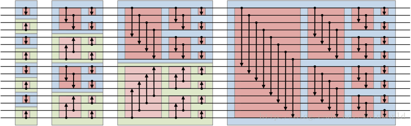
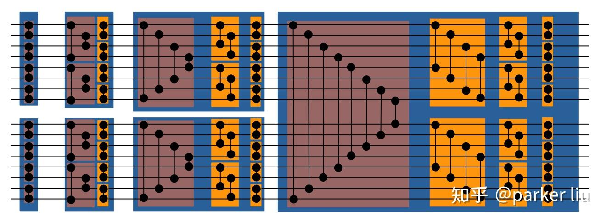

# Top-k算法硬件实现

采用排序的方式在硬件实现，先将序列排序，然后直接选取目标的**最小的k个数**。因此任务的核心是实现排序。

### 排序网络

实现双调排序(Bitonic Sort)网络。
双调序列为先增后减或反之或经过循环左移或者右移后，变成先增后减或先减后增的序列，因此对任意序列需要先将其转化为双调序列，然后再通过双调排序网络排序。

一种双调排序网络如下所示(旧的):

另一种如下图所示(目前实现):

网络由2输入、4输入、8输入排序器组成，构成1个16输入任意序列排序器。若要实现32输入，则需2个这种16输入网络和一个更大的32输入网络才行。

不同输入网络使用的比较交换单元(CAS)数量:

- **2输入**: 1个
- **4输入**: 6个
- **8输入**: 24个
- **16输入**: 80个
- **32输入**: 240个

### 并行化处理

输入约束:
$$n <= 20, k <= 10$$
且n和k不一定为2的幂。

因此需要将n补为2的幂(补上的数设为**最大值**，不影响排序和选择):

- **n <= 4**:  
将n补为4，只用到4输入部分，直接从4输入部分输出，消耗3个周期。
- **4 < n <= 8**:  
将n补为8，只用到8输入部分，直接从8输入部分输出，消耗6个周期。
- **8 < n <= 16**:  
将n补为16，只用到16输入部分，直接从16输入部分输出，消耗10个周期。
- **16 < n <= 20**:  
将n补为32，用到32输入的全部，从最后的输出端输出，消耗15个周期。

支持多组短数据输入进网络进行并行化排序(组间连续)。如4组6元素数据输入，在6周期后得到4组分别排好序的结果。
因此需要8个4输出通道、4个8输出通道、2个16输出通道和1个32输出通道。

##### 如何在Ara里利用Lane的并行性?

在Ara中，1个Lane的数据接口是64位，支持8个8位元素、4个16位元素、2个32位元素和1个64位元素。Ara可以支持2、4、8、16个Lane。
补值后的n最大为32，最小为4。元素如何分到不同Lane里是Ara定的，最少是1个Lane分到2个元素，最多是16个。
因此每个Lane要实现2、4、8、16输入排序，在Lane 0要实现32输入排序,并在Lane 0中取k个数。

这个过程涉及到Lane间数据传递，参考Reduction运算。

### TODO

- [x] 实现第二种网络
- [x] 实现补值功能
- [x] 输出通道选择
- [x] 多组数据并行(多输出通道): 初步实现，还需验证
- [ ] 实现Top-k功能
- [ ] 尝试在Ara中实现
