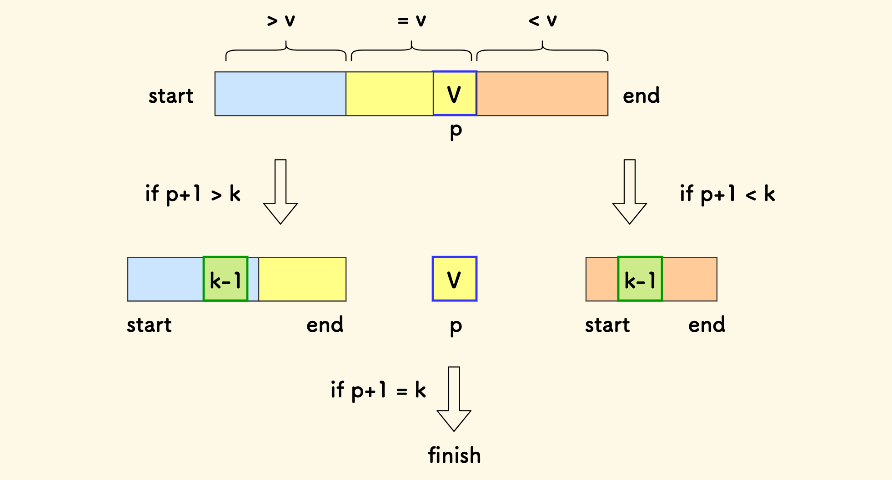
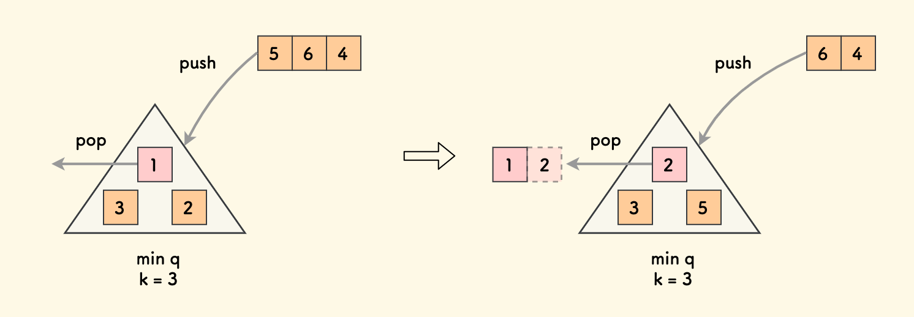
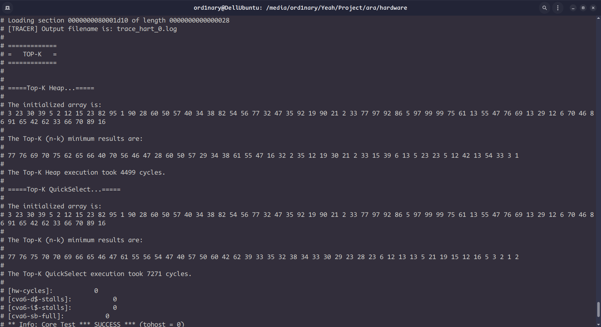

# Top-k算法整理

求n个元素中前k大的数(或前n-k小的数)。

### 排序算法

用冒泡排序、快速排序等方式先将数据按从小到大(或从大到小)排列，就能直接选择前k大的数。

### 快速选择算法(实现)

选择数组中的1个数作为**标志**，然后依次将剩下的n-1个数和这个标志进行比较，比标志大(或等于)的放在其左边，比标志小的放在其右边，完成数组的分割。
分割后标志元素的下标为p。

<p align="center">

<p>

得到整个数组中在标志元素左侧的元素个数p+1。
如果个数比k小，说明标志右侧还有属于前k大的数，需要对标志右侧的数组递归地进行快速选择；如果个数比k大，说明标志左侧有元素不属于前k大的数，需要对标志左侧的数组递归地进行快速选择；当个数等于k时，该数组的标志左侧的k个数就是前k大的数，右侧就是前n-k小的数。时间复杂度最好为O(n)，最差为O(n^2)，当原数组本来就有序时会发生退化。

下面的函数实现了数组的分割。将数组a[start]元素作为标志，分别用left和right指示标志元素的位置和最右侧未比较的元素位置。从start开始依次向右遍历数组，和标志作比较。元素比标志大，则和标志元素交换，放在标志左侧；比标志小，则和最右侧未比较的元素交换，放在标志右侧。函数的返回值就是标志元素最后的下标。

```c
int Partition(int a[], int start, int end) 
{
    int v = a[start];
    int left = start;
    int right = end;
    int i = start;
    while (i <= right) 
    {
        if (a[i] > v) 
        {
            Swap(a, i, left);
            left++;
            i++;
        } 
        else if (a[i] < v) 
        {
            Swap(a, i, right);
            right--;
        } 
        else 
        {
            i++;
        }
    }
    return i - 1;
}
```

根据标志左侧的元素个数判断对哪部分进行递归地快速选择。

```c
void QuickSelect(int a[], int start, int end, int k) 
{
    if (start >= end || k <= 0) 
        return;

    int p = Partition(a, start, end);
    int m = p + 1;  // 整个数组中在基准元素左边的元素个数

    if (k < m) //对左侧快速选择
        QuickSelect(a, start, p - 1, k);
    else if (k > m) //对右侧快速选择
        QuickSelect(a, p + 1, end, k);
    else
        return;
}
```

下面的函数调用快速选择函数，开始递归的过程。

```c
void TopK(int a[], int n, int k)
{ 
    return QuickSelect(a, 0, n - 1, k); 
}
```

### 堆置换算法(实现)

**最小堆**: 用完全二叉树的方式实现，根节点是二叉树中最小的数，每个父节点都比其子节点小。

取k个数构建最小堆，然后将剩余n-k个数依次和堆顶(即二叉树的根节点)比较，如果比堆顶元素大，则替换堆顶元素，再重新整理堆，使其符合最小堆的要求；如果比堆顶元素小(或相等)，则不用替换。当遍历结束后，堆中的k个数就是前k大的数。时间复杂度为O(nlogk)。

<p align="center">

<p>

构建最小堆。完全二叉树的最后一层最左侧父节点的下标是(n-1)/2，从该节点开始向上整理二叉树，使之成为每个父节点比所有子节点都小的树。

```c
void HeapBuild(int a[], int n)           // 堆化
{
    // 从最后一层父节点，不断下沉堆
    for (int i = (n - 1) / 2; i >= 0; i--) {
        HeapDown(a, n, i);
    }
}
```

HeapDown函数完成二叉树的整理。选择父节点的两个子节点中较小的那个和父节点比较，并完成交换。

```c
void HeapDown(int a[], int n, int parent) {
    while (1) {
        // 左孩子 l_child
        int l_child = 2 * parent + 1;
        if (l_child >= n) break;

        // 右孩子 r_child （可能不存在）
        int r_child = l_child + 1;

        // less_child 是其中值更小的孩子
        int less_child = l_child;
        if (r_child < n && a[r_child] < a[l_child]) 
            less_child = r_child;
        if (a[parent] <= a[less_child]) //父节点比子节点更小，不用换位置，直接break
            break;
        Swap(a, parent, less_child); //把父节点换为最小的子节点
        parent = less_child;
    }
}
```

下面的函数完成堆顶的替换和堆的整理。

```c
void HeapReplace(int a[], int n, int v)  // 替换堆顶
{
    if (n <= 0) return;
    a[0] = v;
    //从根节点开始依次整理二叉树
    HeapDown(a, n, 0);
}
```

下面的函数实现比较，在符合替换条件时调用堆替换函数。

```c
void TopK(int a[], int n, int k) {
    if (n <= 0 || k <= 0 || k > n) return;

    // 前 k 个数最小堆化
    HeapBuild(a, k);

    // 剩余的 k .. n-1 元素依次和堆顶比较
    for (int i = k; i < n; i++) {
        if (a[i] > a[0]) {
            // 如果比堆顶大，则替换堆顶
            HeapReplace(a, k, a[i]);
        }
    }
}
```

如果要找前n-k小的数，则要构建最大堆，比较时用比堆顶小的数替换堆顶元素即可。

比较2种算法的性能:

- 堆替换法

```
数组是:
8 7 5 3 6 4 2 0 3 5 9 5 4 5 2 
最小的n-k个数是:
5 4 4 3 3 2 2 0 
Time passed: 0.0000004320s
```

- 快速选择

```
数组是:
8 7 5 3 6 4 2 0 3 5 9 5 4 5 2 
最小的n-k个数是:
5 3 4 4 3 2 0 2 
Time passed: 0.0000006810s
```

尝试通过将程序编译为RISC-V指令(含Vector扩展)用Ara仿真。输入相同的数据时，堆替换算法用的周期数远少于快速选择算法。
<p align="center">

<p>
